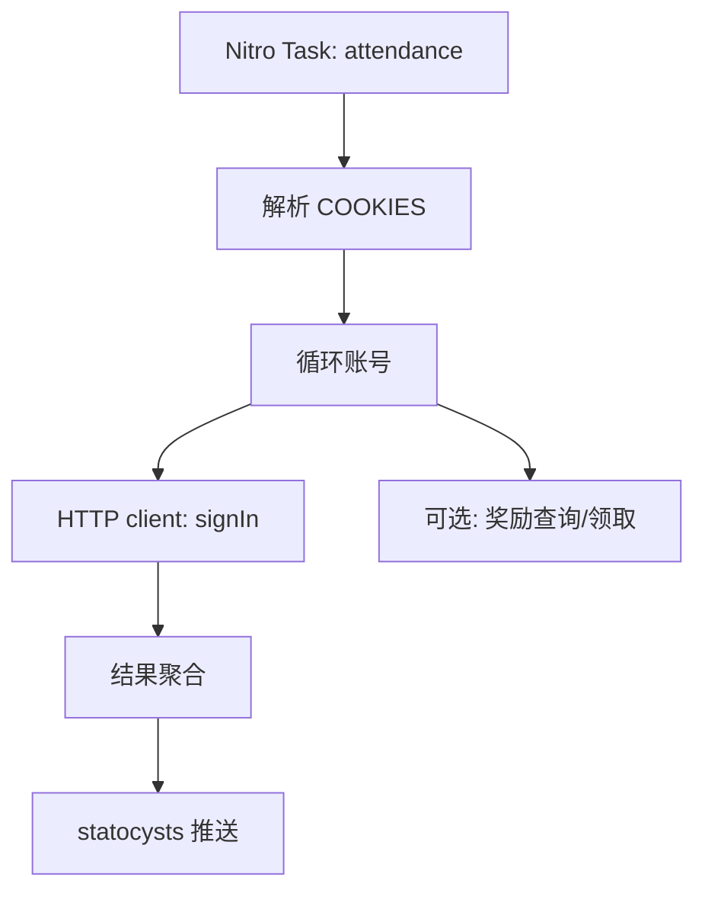

# 技术设计: FF14 石之家每日签到（多账号 + 推送）

## 技术方案

### 核心技术
- Node.js + TypeScript
- Nitro（`defineTask` + `scheduledTasks`）
- `fetch` + `application/x-www-form-urlencoded`
- statocysts（通知聚合）

### 实现要点
- 环境变量 `FF14RS_COOKIES` 支持多账号（逗号或换行分隔）
- 每个账号请求 `POST https://apiff14risingstones.web.sdo.com/api/home/sign/signIn`
  - query 与 body 均携带 `tempsuid`（UUID）
  - headers 至少包含 `content-type`、`accept`，并设置 `origin`/`referer` 以贴近官方前端
  - 使用 `Cookie` 作为认证凭据
- 将响应 `code` 映射为：
  - `10000`: 成功（记录返回的经验/积分信息）
  - `10001`: 今日已签到（视为成功）
  - `10403`: 未登录（Cookie 失效/缺失，标记为失败）
  - 其他: 失败（保留 msg，用于通知摘要）
- 可选领奖：
  - `GET sign/signRewardList` 拉取档位奖励
  - `GET sign/mySignLog` 获取当月签到天数
  - `POST sign/getSignReward` 领取（仅在开启 `FF14RS_AUTO_CLAIM=true` 时执行）

## 架构设计

## 架构决策 ADR

### ADR-001: 使用 Cookie + 纯 HTTP 接口（不做自动登录）
**上下文:** 登录流程可能涉及验证码/风控，自动化登录维护成本高且风险大。我们已确认官方前端使用 Cookie 调用 `sign/signIn` 接口。
**决策:** 项目只接受用户提供的 Cookie（GitHub Secrets），通过 HTTP 调用完成签到与可选领奖。
**理由:** 实现更轻量，风险更低，可维护性更高。
**替代方案:** 浏览器自动化登录/点击 → 拒绝原因: 容易触发验证码/风控，维护成本高。
**影响:** 需要用户定期更新 Cookie；文档必须说明导出与配置方式。

## 安全与性能
- **安全:**
  - 不记录 Cookie 原文；日志仅输出账号序号与 Cookie hash 短标识
  - Secrets 仅通过环境变量注入，不写入仓库
- **性能:**
  - 默认串行执行（减少风控）；如后续需要可限速并发

## 测试与部署
- **测试:** 通过本地运行与 GitHub Actions 手动触发验证（成功/已签/未登录）
- **部署:** GitHub Actions `schedule` 定时执行；可选 Docker/Nitro 部署形态后续补齐
