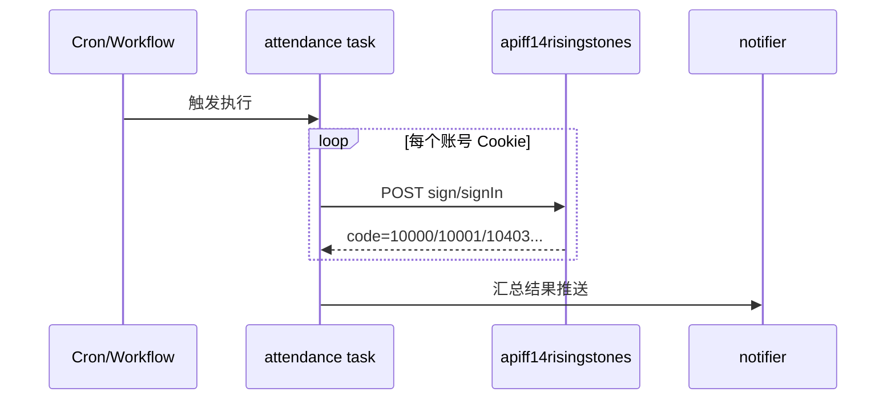

# 架构设计

## 总体架构
```mermaid
flowchart TD
    A[触发器\n(GitHub Actions / Nitro scheduledTasks)] --> B[任务: attendance]
    B --> C[HTTP: sign/signIn]
    B --> D[可选: rewardList / getSignReward]
    B --> E[通知聚合: statocysts]
```

## 技术栈
- **运行时:** Node.js
- **实现:** TypeScript + Nitro（tasks/scheduledTasks）
- **通知:** statocysts（多渠道推送）
- **状态存储（可选）:** unstorage（本地 fs-lite / Upstash / Redis / S3 等）

## 核心流程


## 重大架构决策
| adr_id | title | date | status | affected_modules | details |
|--------|-------|------|--------|------------------|---------|
| ADR-001 | 使用 Cookie + 纯 HTTP 接口（不做自动登录） | 2026-02-13 | ✅已采纳 | utils, tasks, ci | `helloagents/history/2026-02/202602132151_ff14risingstones_attendance/how.md#adr-001-使用-cookie--纯-http-接口不做自动登录` |
